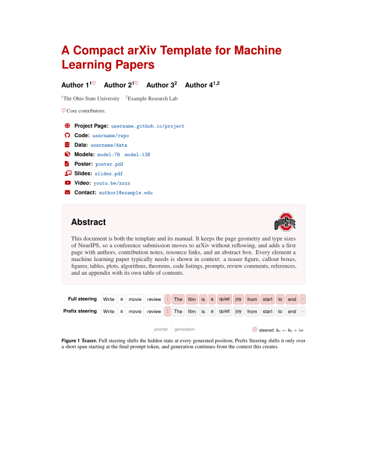

# arXiv Template for Machine Learning Papers

A compact LaTeX template with a customizable title page, resource links, an optional outline, and matching paper elements.

[View the example PDF](example.pdf) · [Explore the source](main.tex)

[](example.pdf)

## Quick start

1. Download or clone this repository.
2. Edit `main.tex` and `reference.bib`, and replace `logo.pdf` with your own logo.
3. Compile with a recent TeX Live installation:

   ```sh
   latexmk -pdf main.tex
   ```

The [example PDF](example.pdf) and [`main.tex`](main.tex) document the layout, commands, and customization options.
Before sharing your paper, disable review comments by commenting out `\showcommentstrue` in `macro.tex`.

## TODO

- [ ] Submit the template to the Overleaf Gallery.
- [ ] Add a slides template.
- [ ] Add a poster template.
- [ ] Add a project page template.

## License

The template code and documentation are available under the [MIT License](LICENSE).
The Ohio State University logo (`logo.pdf`, also shown in the previews) is excluded from this license; replace it for your own paper.
